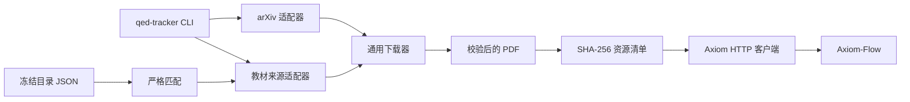

# QED-Tracker 0.3 架构

## 目标与边界

QED-Tracker 是可安装的本地 CLI，不运行服务、不连接数据库。它产出经过校验的原始 PDF 和稳定来源清单；Axiom-Flow 从此边界之后负责解析与审阅。

## 包职责

| 模块 | 职责 |
| --- | --- |
| `config.py` | TOML、环境变量和命令行覆盖；解析数据根、来源和 Axiom URL。 |
| `models.py` | 候选、目录目标、匹配结果和资源 schema。 |
| `providers/` | 隔离来源协议与 HTML/API 解析，不直接写文件。 |
| `matching.py` | 题名、作者、语言和版次的保守匹配。 |
| `downloader.py` | 重试、Range 续传、PDF 校验、SHA-256 和原子落盘。 |
| `inventory.py` | 内容哈希身份、单资源 JSON、确定性 JSONL 和 Axiom 传输记录。 |
| `services.py` | 搜索、下载、去重和冻结目录用例。 |
| `axiom.py` | Axiom 健康检查、multipart 上传和显式解析任务。 |
| `cli.py` | 唯一用户入口和稳定退出码。 |

## 数据不变量

1. 来源适配器不得直接写入正式 PDF。
2. `.part` 只有校验成功后才能原子替换目标文件。
3. `sha256:<digest>` 是跨路径稳定身份；相同内容只保留一个资源记录。
4. 资源 JSON 保存本项目事实，Axiom 状态写入独立 transfer JSON。
5. `inventory scan` 只登记数据根内 PDF，不移动或删除原件。
6. 目录 JSON 是可选输入，不是下载核心依赖；`math-qe` 永久标记为 frozen。

## 已删除边界

0.2 的 FastAPI、SQLAlchemy、多数据库、repository/model、GitHub/RSS、官方文档镜像和硬编码 Python curricula 均不再属于项目。Git 历史只用于追溯，不能视为当前接口。
