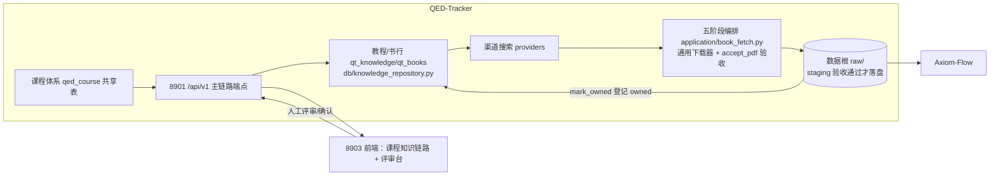

# 主链路架构：课程梳理 → 教材寻找 → 取书 → 复核

设计状态：Accepted
实现状态：Implemented
最后更新：2026-09-09
关联代码：src/qed_tracker/courses.py、src/qed_tracker/main_line/（advisor.py）、src/qed_tracker/db/knowledge_repository.py、src/qed_tracker/application/book_fetch.py、src/qed_tracker/cli.py（courses/mainline/books 命令组）
关联测试：tests/test_courses.py、tests/test_main_line_advisor.py、tests/test_main_line_cli.py、tests/test_book_fetch.py、tests/test_encoding_regression.py
关联 ADR：—
需求方：QED-Engine（8903 前端知识链路消费；根仓库 [course-acquisition-flow.md](../../../docs/design/course-acquisition-flow.md) 五阶段流程对齐）
执行方：QED-Tracker

> 本文件是主链路的架构文档。设计细节（数据模型、端点契约、评审表单）见
> [主链路设计](../design/main-line-curriculum.md)；实现按主链路计划完成（QED-026 已关闭，
> 见[已完成任务台账](../trackers/completed.md)；提交链 948fa88~ea905b9，全量 221 passed + 3 skipped）。
>
> **QED-050-D 书库化重接（2026-09-06）**：条目存储由 `meta/main-line/` JSON 改为
> `qt_knowledge`/`qt_books`（0018 重建契约）；取书重接为五阶段链（检索→确认→下载→机器验收→
> 登记，`mark_owned` 唯一登记入口，`raw/` 即下载与人工导入共用成品区）；`approve`/`reject`
> 删除、`verify` 改只读复核。取书/登记语义唯一设计事实源见
> [下载管线设计](../design/download-pipeline.md)。

## 背景与目标

现有 `catalog/evaluate` 任务是**渠道与功能评估工具**（验证来源可达性、LLM 评分链路），不是
用户的主学习链路。用户主链路是：

1. **领域课程梳理**：确定学科的基础课程体系（先修关系、学习顺序），供 8903 前端知识链路展示；
2. **课程教材寻找**：按课程逐门寻找最佳经典教材（教材 + 习题集），标注版本/评价/下载建议，
   供人工评审；
3. **下载**：从各渠道下载（统一临时区），记录渠道有效性，剔除无效渠道；
4. **人工验收**：给出文件绝对路径，人工验收；不通过则按建议重下或换渠道。

本架构把主链路作为**与 evaluate 平行的独立体系**落地，职责分离、互不干扰。

## 第一版范围（验证阶段）

- **课程**：只梳理并跑通 3 门基础课——**数学分析（01）、高等代数（02）、概率论与数理统计（00）**
  （数学专业本科核心三课，均无前置；后续课程按用户正式确认再扩展，不自动推广）。
- **教材**：每门课程找到并标注最佳经典教材 + 配套习题集（沿用「2–4 套，贵精不贵多」原则）。
- **落位**：下载文件先进本仓库临时数据根（可删可重建）；机器验收通过即落 `raw/` 成品区，
  `mark_owned` 登记 owned 即完成（QED-050-D 后无「复制移交根仓库」步骤，原第一版移交语义已退役）。
- **渠道**：主链路内记录每次渠道尝试（来源/成功/失败/耗时），人工可据记录剔除无效渠道；
  与 [来源评估矩阵](../plans/2026-09-source-discovery.md)（人工评估结论）互补，不重复。

## 课程体系（用户 2026-08-12 审理）

- 数据文件：`docs/knowledge/*.json`（math/computer-science 标准答案 JSON）经
  `qed-tracker knowledge import` 确认导入 `qed_course` 共享表，运行时读表
  （原包内迁移种子 math.json 已随 ADR 0006 迁移链退役，无迁移种子）。
- **三大无前置基础课**：00 概率论与数理统计（新增课程）、01 数学分析、02 高等代数
  （= catalog 线性代数，同一课程不同名称）。
- 14 门课程完整清单、先修关系（DAG）、阶段划分见
  [主链路设计](../design/main-line-curriculum.md) 第 1 节；`related_targets` 只关联已通过二次
  确认评估（人工验收 approved）的课程目标，当前全部为空，随验收逐步回填。

## 架构

**职责边界：**

| 层 | 内容 |
| --- | --- |
| 课程体系（`courses.py`） | 课程体系读取：`qed_course` 共享表（数据经 `docs/knowledge/` 标准答案 JSON 确认导入，无迁移种子）：学科课程清单 + 前置关系（先修→后修 DAG）+ 学习阶段 + 名称映射。 |
| 教程/书行（QED-031 起，QED-050-D 书库化） | 存储 = `qt_knowledge`（教程两态 draft/confirmed + refs 决定引用）+ `qt_books`（书库化：四选用态 candidate/decided/parallel/retired + 持有态 holding owned/missing），归属由 refs 承载；条目服务在 `db/knowledge_repository.py`。 |
| 取书链（`application/book_fetch.py`，QED-050-D） | 书级/教程级 fetch：五阶段（检索→确认→下载→staging 机器验收→登记 owned），人工导入经 `/books/{id}/import` 汇合同一登记服务。 |
| 渠道记录 | qt_sources 运行时事实（来源、成功/失败、文件、备注），支撑「渠道有效性表」（`mainline channels` 聚合）。 |
| 落位 | 数据根 `raw/<domain_id>/<course_id>/` 即成品区（机器验收通过才落盘）；无「复制移交根仓库」步骤。 |
| 8901 API | `/courses` 课程体系 + 知识/书籍端点组（列表/确认/fetch/import/登记），8903 前端消费。 |

## 与现有体系的关系

| 现有体系 | 与主链路关系 |
| --- | --- |
| `catalog/evaluate` 任务 | 已退役（QED-030）；渠道评估职责由教材搜索/下载路径承接。 |
| `meta/resources/` + 五层表（qt_knowledge/qt_books/qt_sources） | 资源登记链路保留（下载文件校验/哈希/登记，旧三表已退役）；QED-050-D 书库化后主链路条目即 `qt_knowledge`/`qt_books` 行，登记统一走 `mark_owned`。 |
| `catalogs/math-qe.json` | 现有 13 门课程目录（研究生 QE 方向）保留；主链路课程体系与之并行，`course_id` 命名对齐（同一课程不同名称由用户审理映射，如「线性代数/高等代数」）。 |
| 来源适配器 / 通用下载器 | 复用：主链路下载仍走 providers → 通用下载器 → 校验/哈希，不新建下载实现。 |
| 8903 前端 | 课程知识链路与评审台经 `/courses` API 与主链路端点消费（数据源切换 REQ-035）。 |

## 关键设计决策（已确认）

1. **课程体系 = 共享表 + API 透出**：课程数据迁入 `qed_course`（2026-08-16 用户裁决 JSON 退役；
   原迁移种子 `migrations/data/math.json` 已随 ADR 0006 退役，现行导入源为 `docs/knowledge/` 标准答案 JSON）→
   `GET /courses`（8901，QED-033 已实现）→ 8903 知识链路。catalog 不动。
2. **主链路教材条目 = 独立数据**：五要素（课程 + 版本/评价/建议 + 渠道记录 + 验收状态），
   存储于 `meta/main-line/`，与现有候选/资源解耦。（**QED-050-D 书库化后失效**：条目改落
   `qt_knowledge`/`qt_books`，JSON 条目模型退役。）
3. **本仓库数据根 = 临时**：下载/登记先落本仓库 `dataset/qed-tracker/`（可删可重建）；
   **人工验收通过后复制 + 登记同步移交根仓库 `dataset/qed-tracker/`**（临时区副本保留留痕）。
   （**QED-050-D 后失效**：`raw/` 即下载与人工导入共用成品区，`mark_owned` 登记 owned 即
   完成，无「复制移交」步骤。）
4. **渠道有效性 = 运行时记录 + 文档矩阵互补**：主链路条目记录实际尝试（自动），
   来源评估矩阵记录人工评估结论（文档）；两者共同支撑渠道决策。
5. **乱码修复与存量清理**：解析/登记链路强制 UTF-8；存量乱码（任务/资源 JSON、
   《突破朗道位垒》txt）作为临时记录清理或重编码。
6. **LLM 评价校准**：权威性等级高/中/低 + 防「总评高」对比评级约束（见
   [主链路设计](../design/main-line-curriculum.md)）。
7. **mainline new 参照顶尖大学**：先参照 MIT/清华等课程设置，再按此探索候选（用户确认）。

## 已确认（原待确认项，QED-026 实现收口）

- 主链路 8901 端点：**已实现**（`/courses` 课程体系只读端点 QED-033 + 主链路条目/评审端点组），
  同时保留 CLI 闭环（`courses`/`mainline` 命令组）双轨。
- LLM 预填实现：**已实现**（`main_line/advisor.py`，参照顶尖大学 + 防总评高校准）；密钥唯一
  变量 `API_KEY`（`QWEN_API_KEY` 别名已退役，见
  [服务管理中心设计](../design/service-management.md)）。
