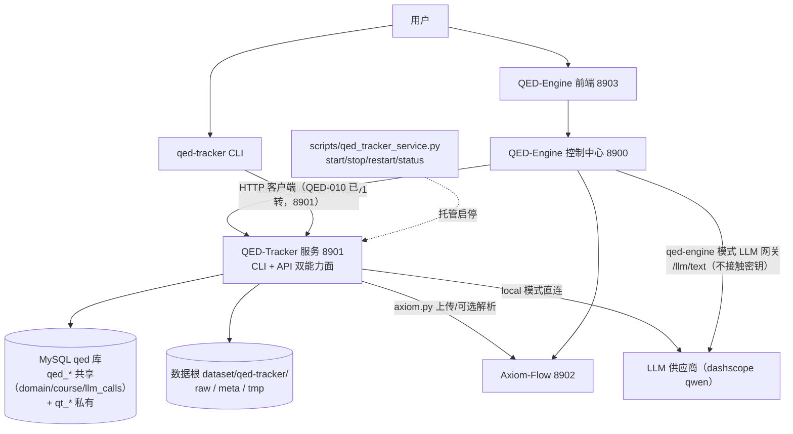
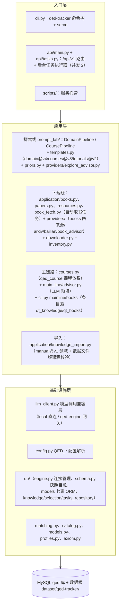

# 系统总览

设计状态：Accepted
实现状态：Implemented
最后更新：2026-09-09
关联代码：`src/qed_tracker/api/`、`src/qed_tracker/application/`、`src/qed_tracker/providers/`、`src/qed_tracker/db/`、`src/qed_tracker/cli.py`
关联测试：`tests/test_api.py`、`tests/test_cli_architecture.py`、`tests/test_services.py`、`tests/test_paper_application.py`、`tests/test_db_models.py`
关联 ADR：[ADR 0001](../adr/0001-tracker-service-architecture.md)

## 职责边界

QED-Tracker 是本地优先的 PDF 获取组件：发现、下载、校验和登记原始 PDF，并通过 8901 HTTP 服务
（`/api/v1`）向统一 CLI 与 8903 前端暴露能力。长操作（下载、评估、推荐）由后台任务执行并以
任务状态轮询暴露，不阻塞请求。资源事实存放于 `meta/resources/` 单资源 JSON，MySQL `qed` 库
五层模型（`qed_domain`/`qed_course`（共享）→ `qt_knowledge`/`qt_books`/`qt_sources`（私有））作为册级明细登记索引（无密码时降级）。

Axiom-Flow 从 HTTP 导入边界之后负责不可变文档存储、OCR/解析、质量审阅和知识发布。两个项目
不互相导入 Python 包，不共享数据库表或数据目录（共享 `qed` 库实例，`qt_*`/`af_*` 表命名空间
隔离）。

主链路（领域课程梳理 → 教材寻找 → 取书 → 复核）已实现（QED-026，QED-050-D 书库化重接），
架构见[主链路架构](main-line.md)：课程体系读 `qed_course` 共享表（`/courses` API 透出；
数据经 `docs/knowledge/` 确认导入，ADR 0006 起无迁移种子）；教程与书行落
`qt_knowledge`/`qt_books`（模型即 schema，ensure_schema 自愈）；取书走
五阶段链（检索→确认→下载→机器验收→登记，`mark_owned` 唯一登记入口），`raw/` 即下载与人工导入
共用成品区，无「复制移交」语义（CLI courses/mainline/books 命令组，见
[主链路设计](../design/main-line-curriculum.md)与[下载管线设计](../design/download-pipeline.md)）。

## 系统架构（组件视图）

QED-Tracker 在 QED-Engine 体系中的位置与外部组件拓扑（端口、依赖与降级边界）：



- **组件模式（默认）**：8900 经 `tracker_client` 消费 8901；LLM 走 `qed-engine` 网关（密钥只
  在 8900）；`scripts/qed_tracker_service.py` 托管启停。
- **独立模式**：仅启动本项目时 CLI + 8901 照常工作；LLM 走 `local` 直连（唯一密钥变量
  `API_KEY`）；MySQL 未配置时登记/查询端点按契约 409，文件系统能力（下载/校验/清单）不受影响。
- **降级铁律**：8900 离线时 8901 以本地默认配置降级运行；8901 离线不影响根仓库前端与 Axiom-Flow。

## 项目架构（模块视图）

QED-Tracker 内部按「入口层 → 应用层（三条设计模块线 + 导入迁移）→ 基础设施层 → 数据」分层；
探索与下载两条设计模块线各自支持手动/自动双轨：



**手动/自动双轨在架构中的落点：**

| 设计模块线 | 手动轨（人工确认/录入） | 自动轨（LLM/后台任务） |
| --- | --- | --- |
| 探索线 | `POST /domains/import`（manual@v1 校验，只写文件暂存）+ confirm 双分支（含 courses 直接同步写 courses.json）+ 课程采纳 `source=manual` | 探索 dry-run（领域/课程，模型只产报告不写库） |
| 下载线 | `POST /books/{id}/register` + `POST /books/{id}/import`（人工路径登记/导入，汇合 mark_owned） | `POST /books/{id}/fetch`（book_download 后台任务：五阶段链检索→确认→下载→机器验收→登记） |
| 主链路 | CLI `mainline` 评审闭环（new/review，定稿 confirm）+ `mainline verify` 只读复核 | `main_line/advisor.py` LLM 预填（可审阅，不写资源事实）；取书经 8901 五阶段任务 |

三条线共用基础设施：模型调用一律经 `llm_client.py`（写 `qed_llm_calls` 审计），落库一律经
`db/knowledge_repository.py`（状态机 + 彻底隐藏过滤），文件一律落数据根并经 `inventory.py`
以 SHA-256 登记。

## 运行模式

QED-Tracker 可**独立运行**，也可作为 QED-Engine 体系的**组件运行**。两种形态的能力面相同
（8901 HTTP API + `qed-tracker` CLI），差别只在配置来源与依赖完整度：

| | 组件模式（默认） | 独立模式 |
| --- | --- | --- |
| 启动方式 | 根仓库 8900 控制中心经 `scripts/qed_tracker_service.py` 托管启停（start/stop/restart/status，`--mode` 参数） | 单独 clone 后 `qed-tracker serve`（`--port`，默认取 `QED_TRACKER_PORT`=8901） |
| 配置来源 | 根 `.env` 注入完整 `QED_*`（DB、密钥、来源、端口） | 自身 `.env` 的「独立运行底线键」→ 内置默认值，启动时输出降级尾注 |
| LLM 线路 | `QED_API_SELECT=qed-engine`（经 8900 网关，不接触密钥）或 `local` 直连 | `local` 直连（唯一密钥变量 `API_KEY`） |
| MySQL 登记 | 完整（`QED_DB_*` 齐备） | 未配置时降级：服务与 CLI 正常启动，登记/查询相关端点按契约 409，登记暂缓 |
| 消费方 | 8900 后端 + 8903 前端 + 统一 CLI | 用户直接 CLI/HTTP 调用 |

两种模式共用同一配置解析链（真实环境变量 > 自身 `.env` > 根 `.env` 兜底 > 内置默认），组件与
独立形态的差别由配置完整度自然产生，不设单独的构建或代码开关。独立性铁律：根仓库后端离线
时本服务以本地默认配置降级运行；本服务离线不影响根仓库前端与 Axiom-Flow。

服务启停契约、PID/日志运行事实、配置键与模型模式事实源见
[服务管理中心设计](../design/service-management.md)与 `src/qed_tracker/config.py`，
降级尾注语义见[服务管理中心设计](../design/service-management.md)，
可复制运行命令见[操作指南](../guides/operations.md)。

### 独立运行能力面

独立模式（只启动本项目）下核心功能的入口覆盖（命令组详情与退出码见
[操作指南](../guides/operations.md)）：

| 能力 | CLI 出口 | 依赖 MySQL |
| --- | --- | --- |
| 下载与清单 | 有：`books`（get/fetch-url/import）、`papers`（search/get/recommend、selections、profiles）、`catalog`（list/show/run）、`inventory`（scan/list/verify）、`axiom push` | 否（文件系统 + 外部 HTTP） |
| 主链路与课程 | 有：`courses`（list/show）、`mainline`（list/new/review/download/verify/channels，approve/reject 已删）、`books`（fetch/import/get/fetch-url）、`domains`（import/confirm）、`knowledge import` | 是（课程体系读 `qed_course` 共享表，教程/书行落 `qt_*`） |
| 服务启动与配置 | 有：`serve`、`config show` | 可选（未配置时按上表「MySQL 登记」行降级） |
| 探索管线 dry-run（领域/课程） | 有：`domains explore`（经 8901 dry-run 同步执行）；课程 dry-run 仅 8901 API | — |
| prompt 优化评估 | 无（仅 8901 API） | — |

- 未配置 `QED_DB_*` 时服务与 CLI 仍可启动；依赖 MySQL 的命令与登记/查询端点按契约返回 409，
  登记暂缓，文件系统能力（下载/校验/清单）不受影响。
- CLI→HTTP 客户端化（QED-010）已完成并经真实 8901 全链路冒烟验收（2026-09-09，见[完成台账](../trackers/completed.md)）。

## 模块职责

| 模块 | 职责 |
| --- | --- |
| `api/` | FastAPI 服务（8901，前缀 `/api/v1`）：健康检查、领域/课程管理、教程两态（confirm；reject/supersede/complete 已删）、自动取书、探索 dry-run、任务端点与后台任务执行器（并发上限 2）。 |
| `config.py` | 读自身 `.env` → 根 `.env`（兜底）→ 内置默认的 `QED_*` 变量与密钥（`API_KEY` 唯一密钥变量、`QED_API_SELECT`、`QED_MODEL`、`QED_AXIOM_URL`、`QED_TRACKER_PORT`、`QED_TRACKER_URL`、`QED_PROXY`、`QED_DB_*`、`QED_SOURCES` 等）；本地 TOML 与旧 `QED_TRACKER_*` 变量（LLM 密钥、来源列表等）已退役。 |
| `llm_client.py` | 模型调用兼容层（QED-037）：`local`（直连 dashscope qwen）/ `qed-engine`（经 8900 网关 `/llm/text`，不接触密钥）；local 调用记录写 `qed_llm_calls`。 |
| `models.py` | 定义候选、目录目标、论文目标与评分、匹配结果、资源记录与下载方案链接（`Candidate.links`）。 |
| `application/` | 分别编排 books、papers 和 resources 用例；不实现外部协议。 |
| `application/book_fetch.py` | 五阶段取书编排（QED-050-D）：检索→确认（预筛→enrich→LLM）→候选级预算下载→staging 机器验收→mark_owned 登记；书级 fetch + 教程级 fetch_tutorial（refs 聚合、排除 owned、顺序逐书），全部失败转人工指引。 |
| `application/knowledge_import.py` | 手动领域导入校验器（manual@v1）：领域/课程知识 JSON 契约校验，供 `POST /domains/import` 端点与 CLI 复用。 |
| `application/domain_file.py` | 领域/课程探索 JSON 文件读写层：`raw/<domain_id>/domains.json`、`raw/<domain_id>/courses.json`、`raw/<domain_id>/<course_id>/tutorials.json` 的幂等写入与读取（覆盖前供确认视图与 confirm 双分支消费）；已完成收口（QED-061）：domains.json 反写最终课程、courses.json 删除、tutorials.json 就地定稿。 |
| `prompt_lab/` | 探索管线工作台：DomainPipeline（领域→课程两步，courses@v8 输出含 stage/prerequisites）/ CoursePipeline（tutorials@v2 单步）、模板注册表（domain@v4/courses@v8/tutorials@v2）与领域先验（priors.py）；dry-run 评估模式不写任何表。设计见[探索管线设计](../design/exploration-pipeline.md)。 |
| `providers/` | 搜索外部来源并解析候选或下载地址，不写正式文件；libgen_li 为发现专用来源（恒 `metadata_only`）。 |
| `providers/book_advisor.py` | 百炼书籍顾问：检索词变体（book-query/variants@v1）与候选确认评估（book-confirm/assess@v1，可审阅，不写资源事实）。 |
| `matching.py` | 对冻结目录执行保守的标题、作者、语言和版本匹配。 |
| `downloader.py` | 处理从头重试、PDF 校验、SHA-256 和原子落盘；`accept_pdf` 机器验收门（页数/大小硬门槛 + 文本层软信号）。 |
| `inventory.py` | 保存单资源 JSON、完整性结果和 Axiom 传输记录（`manifest.jsonl` 已停用）。 |
| `catalog.py` | 读取包内只读目录数据。 |
| `db/engine.py` | 连接管理：按 `QED_DB_*` 构造 SQLAlchemy 引擎（QueuePool 参数化）、会话工厂、`utc_now`、`dispose`。 |
| `db/schema.py` | `ensure_schema` 快照自愈：七表缺表补建/列不一致重建（含共享表）、`qed_llm_calls` 缺列增量补齐（绝不 DROP）、幂等；取代 Alembic 迁移链（ADR 0006）。 |
| `db/models.py` | SQLAlchemy ORM（七表 + 状态枚举），schema 唯一实施事实源（注释随模型 `comment=`）。 |
| `db/knowledge_repository.py` | 五层仓库（qt_knowledge/qt_books/qt_sources + 领域/课程 CRUD；adopt_tutorials/mark_owned/add_source）。 |
| `db/selection_repository.py` | qt_selections 论文选择报告读写层（REQ-032）。 |
| `db/tasks_repository.py` | qt_tasks 读写层（REQ-032）；调度器在 `api/tasks.py`（TaskManager）。 |
| `profiles.py` | 加载并校验内置或自定义论文目标档案。 |
| `axiom.py` | 执行健康检查、multipart 上传和可选解析请求。 |
| `cli.py` | 提供唯一用户入口、机器输出、稳定退出码与服务启动命令（`serve`，启动时执行 `ensure_schema`）。 |
| `courses.py` | 学科课程体系加载（qed_course 共享表；数据经 `docs/knowledge/` 确认导入，无迁移种子）；主链路见 [main-line.md](main-line.md)。 |
| `main_line/` | 主链路 LLM 预填顾问（`main_line/advisor.py`，可审阅评价，不写资源事实）；教程/书行状态机与登记在 `db/knowledge_repository.py`（qt_knowledge/qt_books）。 |

## 数据布局

```text
dataset/qed-tracker/
├── raw/books/{inbox,math-qe/<course-id>}/        # 教材（kind=book）
├── raw/exercises/inbox/                          # 习题集（kind=exercise 独立）
├── raw/papers/<year>/                            # 论文
├── meta/{resources,transfers}/                   # JSON 状态事实（资源、Axiom 传输）
└── tmp/downloads/<task-id>.part                  # 下载临时区（原子落盘后清理）
```

探索与手动导入 JSON（`application/domain_file.py`）：`raw/<domain_id>/domains.json`（领域知识）、
`raw/<domain_id>/courses.json`（领域课程探索/手动导入**中间态**，`已完成` 时反写 domains.json 并删除）、
`raw/<domain_id>/<course_id>/tutorials.json`（课程探索结果，`已完成` 时就地定稿为课程知识 JSON）。

主链路扩展（已实现，QED-050-D 书库化）：`courses.py`（包内，非数据根）提供课程体系；教程与
书行落 `qt_knowledge`/`qt_books`（不再使用 `meta/main-line/` JSON 条目）。取书经五阶段链落
`raw/<domain_id>/<course_id>/`（机器验收通过才 os.replace 进 raw/），`mark_owned` 登记后
`raw/` 即成品区（本仓库数据根为临时中转，可删可重建；无「复制移交根仓库」步骤）。

PDF 路径可以变化，内容身份固定为 `sha256:<digest>`。`meta/resources/` 中的单资源 JSON 是本地
资源事实源；MySQL 五层模型是册级明细登记索引（书籍登记经 `mark_owned` 唯一入口）；
论文选择与任务记录已迁 `qt_selections`/`qt_tasks` 表（`meta/selections/`、`meta/tasks/` 已退役），
分别保存，不能混入资源事实。任务经 `GET /api/v1/tasks/{task_id}` 轮询与「任务 → 文件」跳转。

## 系统不变量

1. 来源适配器只搜索和解析下载地址，不得直接写正式 PDF；libgen_li 恒 `metadata_only`，永不自动写文件。
2. `.part` 只有通过 PDF 结构校验后才能原子替换目标文件。
3. 相同 SHA-256 只保留一条资源记录；新下载产生的重复文件由资源服务移除。
4. `inventory scan` 只接受数据根内部路径，不移动或删除已有 PDF。
5. 包内目录是可选输入，不是下载核心依赖；`math-qe` 永久标记为 `frozen`。
6. 外部来源、网络和 Axiom 失败不能破坏已经登记的本地资源事实；登记顺序为落盘 → 资源 JSON → MySQL，任一步失败任务失败且可重放。
7. LLM 只能生成检索计划和评分；下载必须引用固定报告、经人工确认（`confirm`）后由任务触发，模型不写入资源事实。
8. 长操作（下载、评估等）全部经后台任务执行（并发上限 2，同类型任务 dedup 查重），任务状态落盘并支持轮询；轻量状态迁移（`confirm`/`register`）同步执行；非法状态迁移返回 409。

## 架构符合度

不变量与跨项目契约的当前状态、证据与跟踪（约束偏差以稳定 `ARCH-NNN` 在台账双向登记，文档不得标为完全实现）：

| Accepted 约束 | 当前状态 | 证据与跟踪 |
| --- | --- | --- |
| 1. 来源适配器只搜索和解析下载地址，不直接写正式 PDF；libgen_li 恒 `metadata_only` | 符合 | `src/qed_tracker/providers/`、`application/books.py`（resolve 后才下载）；`tests/test_book_providers.py`（libgen resolve 无 download_url） |
| 2. `.part` 只有通过 PDF 结构校验后才能原子替换目标文件 | 符合 | `downloader.py`（临时区 + `os.replace`）；`tests/test_download_inventory.py` |
| 3. 相同 SHA-256 只保留一条资源记录，重复文件由资源服务移除 | 符合 | `inventory.py` 幂等复用（书库化后无 DB 级 sha256 唯一约束，明细去重经 `mark_owned`/`add_source` 幂等）；`tests/test_download_inventory.py`、`tests/test_knowledge_repository.py` |
| 4. `inventory scan` 只接受数据根内部路径，不移动或删除已有 PDF | 符合 | `inventory.py`（relative_to 校验 + scan 只登记）；`tests/test_download_inventory.py` |
| 5. 包内目录是可选输入；`math-qe` 永久标记 `frozen` | 符合 | `catalog.py` + `catalogs/math-qe.json`（status=frozen）；`tests/test_config_catalog_matching.py` |
| 6. 登记顺序落盘 → 资源 JSON → 五层登记，任一步失败可重放 | 符合 | `db/knowledge_repository.py`（add_source/mark_owned 幂等）；`tests/test_knowledge_repository.py`、`tests/test_knowledge_api.py` |
| 7. LLM 只生成检索计划与可审阅评分，不写资源事实、不自动下载 | 符合 | `providers/bailian.py`/`book_advisor.py` 只产出评估；`tests/test_bailian_advisor.py`、`tests/test_paper_application.py` |
| 8. 长操作经后台任务（并发上限 2）轮询；轻量状态迁移同步；非法迁移 409 | 符合 | `api/main.py` + `api/tasks.py`；`tests/test_api.py`、`tests/test_knowledge_api.py` |
| 8901 服务端口与 `/api/v1` 前缀（根仓库 ADR 0002） | 符合 | `api/main.py`（FastAPI 8901）；`tests/test_api.py` |
| 数据根默认 `dataset/qed-tracker/`（raw/meta/tmp 布局，根仓库 dataset-conventions） | 符合 | `config.py` 默认值与路径解析；`tests/test_data_layout.py` |
| 共享 `qed` 库实例、`qt_*` 表命名空间隔离（根仓库 ADR 0003） | 符合 | `db/models.py`（qt_knowledge/qt_books/qt_sources + qed_domain/qed_course）；`tests/test_db_models.py` |
| Axiom-Flow 地址默认 `http://127.0.0.1:8902` | 符合 | `config.py`（axiom_url 默认）；`tests/test_axiom.py` |
| 8903 工作台 CORS（仅 127.0.0.1/localhost:8903） | 符合 | `api/main.py`（FRONTEND_ORIGINS）；`tests/test_api.py` |
| 8901 全链路联调与回执（评估→确认→下载→验收→登记→前端展示） | 符合（QED-014 已验收关闭，2026-09-09） | `docs/trackers/completed.md` QED-014 行 |

## 已退出的职责

旧版本的本地 TOML 配置与 `QED_TRACKER_*` 变量、`.qed-tracker/` 数据布局、`manifest.jsonl`、
`QED_TRACKER_LLM_API_KEY`/`DASHSCOPE_API_KEY` 读取路径，以及 GitHub/RSS 跟踪、官方文档镜像和
通用资源中心均不属于当前运行时。追溯其退出原因时只查[旧系统基线](../history/baselines/pre-acquisition-cli.md)，不得从历史说明恢复旧接口。