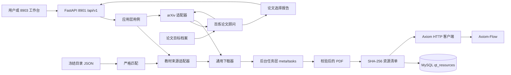

# 系统总览

设计状态：Accepted
实现状态：Implemented
最后更新：2026-08-12
关联代码：`src/qed_tracker/api/`、`src/qed_tracker/application/`、`src/qed_tracker/providers/`、`src/qed_tracker/db/`、`src/qed_tracker/cli.py`
关联测试：`tests/test_api.py`、`tests/test_cli_architecture.py`、`tests/test_services.py`、`tests/test_paper_application.py`、`tests/test_db_models.py`
关联 ADR：[ADR 0001](../adr/0001-tracker-service-architecture.md)

## 职责边界

QED-Tracker 是本地优先的 PDF 获取组件：发现、下载、校验和登记原始 PDF，并通过 8901 HTTP 服务
（`/api/v1`）向统一 CLI 与 8903 前端暴露能力。长操作（下载、评估、推荐）由后台任务执行并以
任务状态轮询暴露，不阻塞请求。资源事实存放于 `meta/resources/` 单资源 JSON，MySQL `qed` 库
`qt_resources` 表作为查询/展示索引（双写，无密码时降级）。

Axiom-Flow 从 HTTP 导入边界之后负责不可变文档存储、OCR/解析、质量审阅和知识发布。两个项目
不互相导入 Python 包，不共享数据库表或数据目录（共享 `qed` 库实例，`qt_*`/`af_*` 表命名空间
隔离）。



## 模块职责

| 模块 | 职责 |
| --- | --- |
| `api/` | FastAPI 服务（8901，前缀 `/api/v1`）：健康检查、搜索、资源闭环（confirm/backup/reject/approve/register）、PDF 预览、任务端点与后台任务执行器（并发上限 2）。 |
| `config.py` | 直读根 `.env` 的 `QED_*` 变量（`QWEN_API_KEY`、`QED_MODEL`、`QED_AXIOM_URL`、`QED_TRACKER_PORT`、`QED_TRACKER_URL`、`QED_PROXY`、`QED_DB_*`、`QED_SOURCES`）；本地 TOML 与旧 `QED_TRACKER_*` 变量（LLM 密钥、来源列表等）已退役。 |
| `models.py` | 定义候选、目录目标、论文目标与评分、匹配结果、资源记录与下载方案链接（`Candidate.links`）。 |
| `application/` | 分别编排 books、papers、catalog/evaluate 和 resources 用例；不实现外部协议。 |
| `providers/` | 搜索外部来源并解析候选或下载地址，不写正式文件；libgen_li 为发现专用来源（恒 `metadata_only`）。 |
| `providers/book_advisor.py` | 百炼教材评估顾问：书目结构化补全与候选评分（可审阅，不写资源事实）。 |
| `matching.py` | 对冻结目录执行保守的标题、作者、语言和版本匹配。 |
| `downloader.py` | 处理从头重试、PDF 校验、SHA-256 和原子落盘。 |
| `inventory.py` | 保存单资源 JSON、完整性结果和 Axiom 传输记录（`manifest.jsonl` 已停用）。 |
| `catalog.py` | 读取包内只读目录数据。 |
| `database.py` | 按 `QED_DB_*` 构造 SQLAlchemy 引擎与会话工厂（服务启动与冒烟复用）。 |
| `db/` | SQLAlchemy ORM（`qt_resources`）、状态机仓库、Alembic 迁移与 `upgrade_database()` 入口。 |
| `profiles.py` | 加载并校验内置或自定义论文目标档案。 |
| `selection_store.py` | 原子保存与读取独立论文选择报告。 |
| `axiom.py` | 执行健康检查、multipart 上传和可选解析请求。 |
| `cli.py` | 提供唯一用户入口、机器输出、稳定退出码与服务启动命令（`serve`）。 |

## 数据布局

```text
dataset/qed-tracker/
├── raw/books/{inbox,math-qe/<course-id>}/        # 教材（kind=book）
├── raw/exercises/inbox/                          # 习题集（kind=exercise 独立）
├── raw/papers/<year>/                            # 论文
├── meta/{resources,selections,transfers,tasks}/  # JSON 状态事实（资源、选择、Axiom、任务）
└── tmp/downloads/<task-id>.part                  # 下载临时区（原子落盘后清理）
```

PDF 路径可以变化，内容身份固定为 `sha256:<digest>`。`meta/resources/` 中的单资源 JSON 是本地
资源事实源；MySQL `qt_resources` 是查询/展示索引，双写一致性由登记服务保证；论文选择和 Axiom
状态分别保存，不能混入资源事实。任务记录落盘 `meta/tasks/<task-id>.json` 供轮询与「任务 → 文件」
跳转。

## 系统不变量

1. 来源适配器只搜索和解析下载地址，不得直接写正式 PDF；libgen_li 恒 `metadata_only`，永不自动写文件。
2. `.part` 只有通过 PDF 结构校验后才能原子替换目标文件。
3. 相同 SHA-256 只保留一条资源记录；新下载产生的重复文件由资源服务移除。
4. `inventory scan` 只接受数据根内部路径，不移动或删除已有 PDF。
5. 包内目录是可选输入，不是下载核心依赖；`math-qe` 永久标记为 `frozen`。
6. 外部来源、网络和 Axiom 失败不能破坏已经登记的本地资源事实；登记顺序为落盘 → 资源 JSON → MySQL，任一步失败任务失败且可重放。
7. LLM 只能生成检索计划和评分；下载必须引用固定报告、经人工确认（`confirm`）后由任务触发，模型不写入资源事实。
8. 长操作（下载、评估等）全部经后台任务执行（并发上限 2），任务状态落盘并支持轮询；轻量状态迁移（`confirm`/`backup`/`approve`/`reject`/`register`）同步执行；非法状态迁移返回 409。

## 已退出的职责

旧版本的本地 TOML 配置与 `QED_TRACKER_*` 变量、`.qed-tracker/` 数据布局、`manifest.jsonl`、
`QED_TRACKER_LLM_API_KEY`/`DASHSCOPE_API_KEY` 读取路径，以及 GitHub/RSS 跟踪、官方文档镜像和
通用资源中心均不属于当前运行时。追溯其退出原因时只查[旧系统基线](../history/baselines/pre-acquisition-cli.md)，不得从历史说明恢复旧接口。