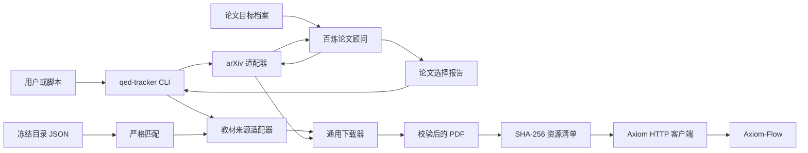

# 系统总览

设计状态：Accepted
实现状态：Implemented
最后更新：2026-07-30
关联代码：`src/qed_tracker/application/`、`src/qed_tracker/providers/`、`src/qed_tracker/cli.py`
关联测试：`tests/test_cli_architecture.py`、`tests/test_services.py`、`tests/test_paper_application.py`

## 职责边界

QED-Tracker 是可安装的本地 CLI，负责发现、下载、校验和登记原始 PDF。它不运行服务、不维护数据库，也不解析 PDF 内容。

Axiom-Flow 从 HTTP 导入边界之后负责不可变文档存储、OCR/解析、质量审阅和知识发布。两个项目不互相导入 Python 包，不共享数据库或数据目录。



## 模块职责

| 模块 | 职责 |
| --- | --- |
| `config.py` | 合并 TOML、环境变量和命令行配置。 |
| `models.py` | 定义候选、目录目标、论文目标与评分、匹配结果和资源记录。 |
| `application/` | 分别编排 books、papers 和 resources 用例；不实现外部协议。 |
| `providers/` | 搜索外部来源并解析候选或下载地址，不写正式文件。 |
| `matching.py` | 对冻结目录执行保守的标题、作者、语言和版本匹配。 |
| `downloader.py` | 处理从头重试、PDF 校验、SHA-256 和原子落盘。 |
| `inventory.py` | 保存单资源 JSON、确定性 JSONL、完整性结果和 Axiom 传输记录。 |
| `catalog.py` | 读取包内只读目录数据。 |
| `profiles.py` | 加载并校验内置或自定义论文目标档案。 |
| `selection_store.py` | 原子保存与读取独立论文选择报告。 |
| `axiom.py` | 执行健康检查、multipart 上传和可选解析请求。 |
| `cli.py` | 提供唯一用户入口、机器输出和稳定退出码。 |

## 数据布局

```text
<data-root>/
├── books/
│   ├── inbox/
│   └── math-qe/<course-id>/
├── papers/<year>/
└── .qed-tracker/
    ├── resources/<sha256>.json
    ├── paper-selections/<selection-id>.json
    └── transfers/axiom/<sha256>.json
```

PDF 路径可以变化，内容身份固定为 `sha256:<digest>`。`.qed-tracker/resources/` 中的单资源 JSON 是本地资源事实源；论文选择和 Axiom 状态分别保存，不能混入资源事实。

## 系统不变量

1. 来源适配器不得直接写正式 PDF。
2. `.part` 只有通过 PDF 结构校验后才能原子替换目标文件。
3. 相同 SHA-256 只保留一条资源记录；新下载产生的重复文件由资源服务移除。
4. `inventory scan` 只接受数据根内部路径，不移动或删除已有 PDF。
5. 包内目录是可选输入，不是下载核心依赖；`math-qe` 永久标记为 `frozen`。
6. 外部来源、网络和 Axiom 失败不能破坏已经登记的本地资源事实。
7. LLM 只能生成检索计划和评分；下载必须引用固定报告并由用户显式选择。

## 已退出的职责

旧版本的 Web API、SQL 数据库、GitHub/RSS 跟踪、官方文档镜像和通用资源中心均不属于当前运行时。追溯其退出原因时只查[旧系统基线](../history/baselines/pre-acquisition-cli.md)，不得从历史说明恢复旧接口。
