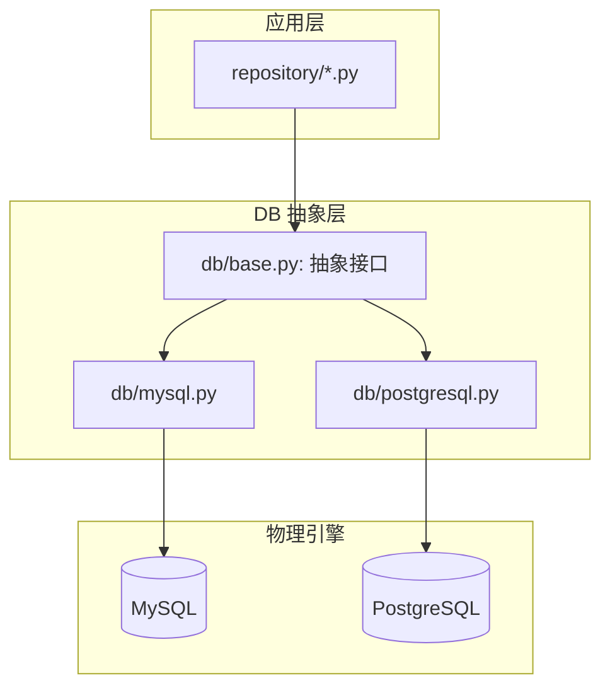

# 数据库设计 v0.2

> 多数据库抽象层：MySQL (本机主力) + PostgreSQL 双适配器

## 架构



## 抽象接口 (db/base.py)

```python
class DatabaseEngine(ABC):
    @abstractmethod
    def connect(self) -> None: ...

    @abstractmethod
    def disconnect(self) -> None: ...

    @abstractmethod
    def execute(self, sql: str, params: dict = None) -> list[dict]: ...

    @abstractmethod
    def get_session(self): ...

    @abstractmethod
    def init_tables(self) -> int: ...

    @abstractmethod
    def check_connection(self) -> bool: ...
```

## 配置方式

```ini
[Database]
engine = mysql              # mysql / postgresql / sqlite
host = localhost
port = 3306
database = qed_tracker
user = root
password =
```

## 4 张核心表

### textbooks

```sql
CREATE TABLE textbooks (
    id VARCHAR PRIMARY KEY,
    course VARCHAR(50) NOT NULL,
    title TEXT NOT NULL,
    author VARCHAR(200),
    language VARCHAR(10) DEFAULT 'zh',
    source VARCHAR(100),
    source_url TEXT,
    local_pdf_path TEXT,
    local_solution_path TEXT,
    stage VARCHAR(20),
    notes TEXT,
    created_at TIMESTAMP DEFAULT NOW()
);
CREATE INDEX idx_textbooks_course ON textbooks(course);
```

### papers

```sql
CREATE TABLE papers (
    id VARCHAR PRIMARY KEY,
    arxiv_id VARCHAR(50) UNIQUE NOT NULL,
    title TEXT NOT NULL,
    title_cn TEXT,
    authors JSON DEFAULT '[]',
    categories JSON DEFAULT '[]',
    published_date DATE,
    source_url TEXT,
    local_path TEXT,
    course_tags JSON DEFAULT '[]',
    notes TEXT,
    created_at TIMESTAMP DEFAULT NOW()
);
CREATE INDEX idx_papers_arxiv ON papers(arxiv_id);
```

### official_docs

```sql
CREATE TABLE official_docs (
    id VARCHAR PRIMARY KEY,
    name VARCHAR(100) NOT NULL,
    version VARCHAR(50),
    source_url TEXT,
    local_path TEXT,
    pages_count INTEGER DEFAULT 0,
    notes TEXT,
    created_at TIMESTAMP DEFAULT NOW()
);
CREATE INDEX idx_docs_name ON official_docs(name);
```

### resources

```sql
CREATE TABLE resources (
    id VARCHAR PRIMARY KEY,
    resource_type VARCHAR(20) NOT NULL,
    title TEXT NOT NULL,
    url TEXT NOT NULL,
    description TEXT,
    course_tags JSON DEFAULT '[]',
    author VARCHAR(200),
    platform VARCHAR(100),
    is_favorite BOOLEAN DEFAULT FALSE,
    notes TEXT,
    created_at TIMESTAMP DEFAULT NOW()
);
CREATE INDEX idx_resources_type ON resources(resource_type);
```

> **注**: MySQL 使用 `JSON` 类型替代 PostgreSQL 的 `JSONB`，功能等价。

## 仓储层

```
BaseRepository[T] → CRUD (get/list/create/update/delete/count/exists)
├── TextbookRepo    (+ get_by_course, exists_by_path)
├── PaperRepo       (+ get_by_arxiv_id, exists_by_arxiv_id)
├── OfficialDocRepo (+ get_by_name)
└── ResourceRepo    (+ get_by_type)
```

## 连接池

- **MySQL**: `pool_size=5, max_overflow=10, pool_pre_ping=True`
- **PostgreSQL**: 同配置，使用 `QueuePool`
- **SQLite** (测试): `:memory:`

## 引擎选择逻辑

```python
def create_engine_from_config(cfg: dict) -> DatabaseEngine:
    engine_type = cfg.get("engine", "mysql")
    if engine_type == "mysql":
        return MySQLEngine(cfg)
    elif engine_type == "postgresql":
        return PostgreSQLEngine(cfg)
    else:
        raise ValueError(f"Unsupported engine: {engine_type}")
```

## 当前状态

| 引擎 | 适配器 | 测试覆盖 | 生产使用 |
|------|--------|---------|---------|
| MySQL | `db/mysql.py` | ✅ 计划 | ✅ 本机主力 |
| PostgreSQL | `db/postgresql.py` | ✅ 已有 (从 v0.1 迁移) | ⬜ 可选 |
| SQLite | conftest.py | ✅ 测试用 | ❌ 仅测试 |
| Hive | — | ❌ 未实现 | 📌 预留 |
