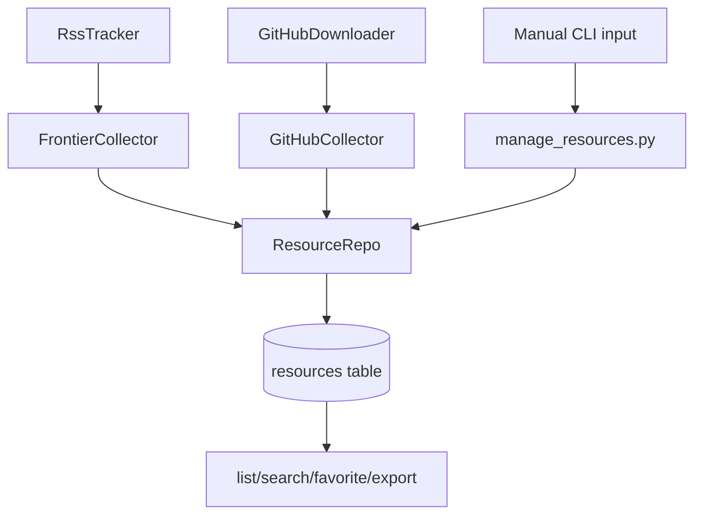

# Resources Hub v0.3

> Status: Accepted
> Scope: shared resource indexing for articles, blogs, videos, GitHub repositories, courses, official docs, and manually curated links.

## Goal

Resources Hub makes the `resources` table the common landing zone for non-textbook assets. RSS frontier articles, GitHub repositories, LLM research targets, videos, courses, and manual links should use the same repository and CLI surface.

## Boundaries

In scope:

- Repository helpers for URL deduplication, text search, favorites, and type filtering.
- A resource management CLI for listing, searching, favoriting, and Markdown export.
- A GitHub collector that stores repository metadata as `resource_type = "repo"`.
- Documentation and tracker updates for T-204 and T-205.

Out of scope for v0.3:

- Downloading GitHub releases or cloning repository documentation.
- LLM-generated summaries.
- Schema migration beyond the existing `resources` table.
- Automated scheduling.

## Resource Types

Use these normalized values in `resources.resource_type`:

| Type | Meaning | Examples |
| --- | --- | --- |
| `article` | Magazine or news article | Quanta Magazine |
| `blog` | Personal or research blog post | Terence Tao blog |
| `paper` | Paper landing page or non-PDF metadata link | arXiv resource references |
| `video` | Video lecture or explanation | YouTube, Bilibili |
| `repo` | GitHub or code repository | `pytorch/pytorch`, `vllm-project/vllm` |
| `doc` | Official documentation link | PyTorch docs |
| `course` | Course page or lecture series | Stanford course pages |

## Architecture



## Repository Contract

`app/repository/resource_repo.py` owns reusable resource queries:

```python
class ResourceRepo(BaseRepository[Resource]):
    def get_by_type(self, rtype: str) -> list[Resource]: ...
    def get_by_url(self, url: str) -> Resource | None: ...
    def exists_by_url(self, url: str) -> bool: ...
    def search(self, keyword: str, resource_type: str | None = None) -> list[Resource]: ...
    def list_favorites(self) -> list[Resource]: ...
    def set_favorite(self, resource_id: str, value: bool = True) -> Resource | None: ...
```

URL is the deduplication key for all collectors.

## CLI Contract

`scripts/manage_resources.py` provides the local operator interface:

```bash
python scripts/manage_resources.py list --type article --limit 20
python scripts/manage_resources.py search probability
python scripts/manage_resources.py favorite <resource_id>
python scripts/manage_resources.py export --format markdown --output resources.md
```

Rules:

- `list` displays id, type, title, platform, favorite marker, and URL.
- `search` matches title, description, author, platform, and URL.
- `favorite` marks one resource as favorite by id.
- `export --format markdown` writes grouped Markdown, sorted by type then title.

`scripts/hunt_github.py` provides the GitHub ingestion entry point:

```bash
python scripts/hunt_github.py pytorch/pytorch vllm-project/vllm
python scripts/hunt_github.py --file repos.txt
python scripts/hunt_github.py --file repos.txt --no-db
```

## GitHub Collector

`app/collectors/github_collector.py` stores GitHub repository metadata without downloading assets:

```text
repo name list
  -> GitHubDownloader.get_repo_info(repo)
  -> Resource(resource_type="repo", title=full_name, url=html_url)
  -> ResourceRepo.exists_by_url(url)
  -> insert missing repositories
```

Metadata mapping:

| GitHub field | Resource field |
| --- | --- |
| `full_name` | `title` |
| `html_url` | `url` |
| `description` | `description` |
| `language` + topics + license + stars | `notes` |
| `GitHub` | `platform` |
| `repo` | `resource_type` |

## Testing

- Resource repository tests use SQLite in-memory fixtures and do not require MySQL or PostgreSQL.
- CLI parsing tests cover `list`, `search`, `favorite`, and `export`.
- GitHub collector tests use a fake downloader and SQLite session; they do not call the network.

## Follow-Up

- Add LLM research target lists in `app/curricula/llm_research.py`.
- Add manual import from YAML or Markdown if curated lists grow.
- Add summary generation once the resource store is stable.
