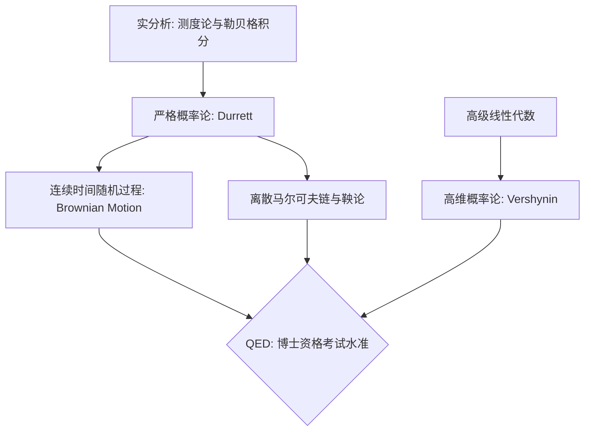

> **状态**: Resolved-部分 (2026-05-20)
> - ✅ 数学教材清单 → 已提取至 `docs/knowledge_base/inventory.md`
> - ✅ 文章/图文/RSS 资料 → 已提取至 `docs/design/frontier_tracking.md`
> - ⏭️ 视频类资料 → 待定（暂未纳入计划）
> - ✅ RSS 采集器实现 → 已实现 `app/tools/rss_tracker.py` / `frontier_collector.py` / `hunt_frontier.py`

要达到顶尖大学数学系 PhD 资格考试（QE）的水准，概率论的学习不能停留在“计算概率、扔硬色子”的微积分应用阶段。数学系的概率论本质上是**测度论（Measure Theory）**的延伸。因此，你需要的路径是从**测度论基础上的严格概率论**开始，一直到作为现代数学核心的**随机过程**。

结合你偏好的美式教材风格（详尽、透彻、重视逻辑），以及你目前的 AI/算法专家背景（对马尔可夫链、高维空间、最优化有直觉），我为你推荐以下教材与习题集体系：

---
## 📚 概率论核心书单与进阶路径

### 1. 核心进阶：测度论现代概率论 (Graduate Probability)

这是数学系博士低年级的必修课，将概率、期望、条件期望全部用测度与积分的语言严格化。

* **教材首选：**
* **Rick Durrett, *Probability: Theory and Examples***
* **地位**：美国绝大多数顶尖大学 Math/Stat PhD 的标准教科书（常年被哈佛、斯坦福、伯克利使用）。
* **风格**：虽然极其严谨，但 Durrett 融入了大量的直观例子和物理/生物背景，废话不多，直击核心。前 4 章（大数定律、中心极限定理、鞅、马尔可夫链）是 QE 的必考重灾区。

* **Patrick Billingsley, *Probability and Measure***
* **风格**：将测度论和概率论融为一体写。如果你的实分析（测度论）底子还在搭建中，这本书是完美的互补教材，它会一边讲测度，一边把概率的对应概念拉出来对比。

* **配套习题集：**
* Durrett 的课后习题质量极高。额外推荐 **理查德·斯通 (Richard S. Song), *Solutions Manual for Probability: Theory and Examples***。

---

### 2. 核心进阶：现代随机过程 (Stochastic Processes)

在机器学习、强化学习（RL）、MCMC 采样中无处不在的数学底层。

* **教材首选：**
* **Ioannis Karatzas & Steven E. Shreve, *Brownian Motion and Stochastic Calculus***
* **地位**：连续时间随机过程和随机微积分的“圣经”。
* **风格**：极其硬核。深入探讨了布朗运动、伊藤引理（Itô's Lemma）、随机微分方程（SDEs）。掌握它之后，你再去理解扩散模型（Diffusion Models）的底层数学机制就会易如反掌。

* **Sheldon Ross, *Stochastic Processes***
* **风格**：如果你想在啃《Karatzas》之前找一本易读、偏向离散时间、强调算法直觉的书，Ross 的这本是美国本科高年级/硕士级的标准教材，非常适合快速建立直觉。

* **配套习题集：**
* **阿斯穆森 (Asmussen), *Applied Probability and Queues***。

---

### 3. AI 算法方向专项拓宽：高维概率论 (High-Dimensional Probability)

作为算法研究员，这门课是**现代大模型理论、压缩感知、非渐近统计**的数学根基，通常是统计系或定量数学 PhD 的杀手课。

* **教材首选：**
* **Roman Vershynin, *High-Dimensional Probability: An Introduction with Applications in Data Science***
* **地位**：近年来在计算机理论和数据科学界封神的教材。
* **风格**：完全用现代视角写作。集中讨论亚高斯（Sub-Gaussian）集中不等式、随机矩阵理论、集中度量（Measure Concentration）。对于理解深度学习在高维空间的泛化边界极其有用。

* **配套习题集：** * Vershynin 课后自带全套开放式思考题，极具启发性。

---

## 📈 概率论与先修课依赖关系

为了让你的 AI Agent 在维护 `knowledge_base/dependency_graph.md` 时有据可依，这里给出它们与其他数学课的连接逻辑：

### 🎯 针对 Axiom-Flow 项目的数字化切入点建议

既然你正在用 **Axiom-Flow** 跑通数字化流程，我建议你把 **Rick Durrett 的 *Probability: Theory and Examples* (第5版)** 作为你项目的**核心测试语料**。

* **原因**：Durrett 的书中混杂了大量的数学符号、推导公式、定理块（Theorem-Proof），以及用于解释物理现象的紧凑插图。
* **通关指标**：如果你的 MinerU 管道能把 Durrett 的 **"Chapter 4: Martingales (鞅)"** 完美还原成 Markdown 且不丢失测度论符号（如 $\mathcal{F}_n$  sigma-代数流），那么你的 Axiom-Flow 引擎在工程上就已经完全合格了。

针对你目前“**10年计算机算法研发 + 渴望夯实硬核数学（通往PhD QE水准）**”的背景，跟踪前沿与科普内容不能只看纯业余的趣味数学，而是要寻找**具有深刻几何直觉、能建立现代数学图景（如拓扑、测度论、流形）的高质量栏目**。

为你精选以下 4 个最匹配你胃口的高端数学科普/前沿渠道，并附带最推荐你优先观看的**精选硬核视频/文章列表**：

---

## 1. 视频类：极致直觉与视觉化

### 🎥 Numberphile (数之乐) & Brady Haran 系列

* **定位**：全球最火的数学科普栏目，直接邀请陶哲轩、Fry 等顶级数学家在棕色牛皮纸上推导。
* **为什么适合你**：它能把极度抽象的概念（如克莱因瓶、黎曼猜想、高维拓扑）讲得非常有物理和几何实体感。
* **首看精选列表**：
1. *The Riemann Hypothesis* (黎曼猜想的几何直观说明)
2. *The Abel Prize Videos* (历届阿贝尔奖得主成就深度解析系列)

### 🎥 Quanta Magazine Video (量子杂志官方视频)

* **定位**：科学界公认最硬核的科普视觉化栏目。
* **为什么适合你**：3Blue1Brown 主要是教学，而 Quanta 专注于**报道当下正在发生的数学突破**（如最新被攻克的几何拓扑难题）。
* **首看精选列表**：
1. *Why This Mathematician Thinks We Settle for Pseudoscience* (数学家关于统计与测度的思考)
2. *How Hyperbolic Geometry Is Trapped in the Corporate World* (双曲几何在现代算法与网络拓扑中的应用)

---

## 2. 文章/图文类：前沿突破与数学思想

### 📰 Quanta Magazine - Mathematics Section (量子杂志数学专栏)

* **定位**：学术界公认最顶尖的科学新闻杂志，其数学主笔均有极深的数学学术背景。
* **为什么适合你**：它是你 `QED-Tracker` 最应该自动爬取的源。文章质量极高，会把最新的 PhD 级论文拆解成高级工程师能看懂的逻辑链条。
* **首看精选文章列表**：
1. *The Random Geometry at the Heart of Physics* (解析物理与概率论核心的随机几何突破)
2. *Mathematicians Prove 2D Version of Quantum Gravity Conjecture* (偏微分方程与几何拓扑在量子引力中的前沿应用)

### 📰 Terry Tao's Blog (陶哲轩的博客 - What's New)

* **定位**：当代最伟大的数学家陶哲轩的个人公开博客。
* **为什么适合你**：虽然是个人博客，但陶哲轩经常用极其通俗且充满启发性的语言，解释他最新的研究或者他对某个数学猜想的思考过程。作为算法研究员，看他的思考路径是一种绝对的享受。
* **首看精选文章列表**：
1. *Simons Lectures: The cosmic distance ladder* (关于测度与调和分析的公开讲座笔记)
2. *Discrete random matrices* (高维概率论与随机矩阵的入门普及)

---

## 💡 自动化跟踪建议 (QED-Tracker 集成)

既然你正在设计 **QED-Tracker**，你可以直接把下面这两个 RSS/API 节点写入你的 `knowledge_base/scholars.md` 中，让 AI Agent 每天自动抓取并总结：

1. **Quanta Magazine RSS**: `https://api.quantamagazine.org/v1/posts?category=mathematics`
2. **Terence Tao Blog RSS**: `https://terrytao.wordpress.com/feed/`

这四个渠道完全能够满足你“既要前沿拓展，又要有足够数学深度”的需求，不会浪费你在低端科普上。你打算先把哪一个源加入你的自动化爬取清单？