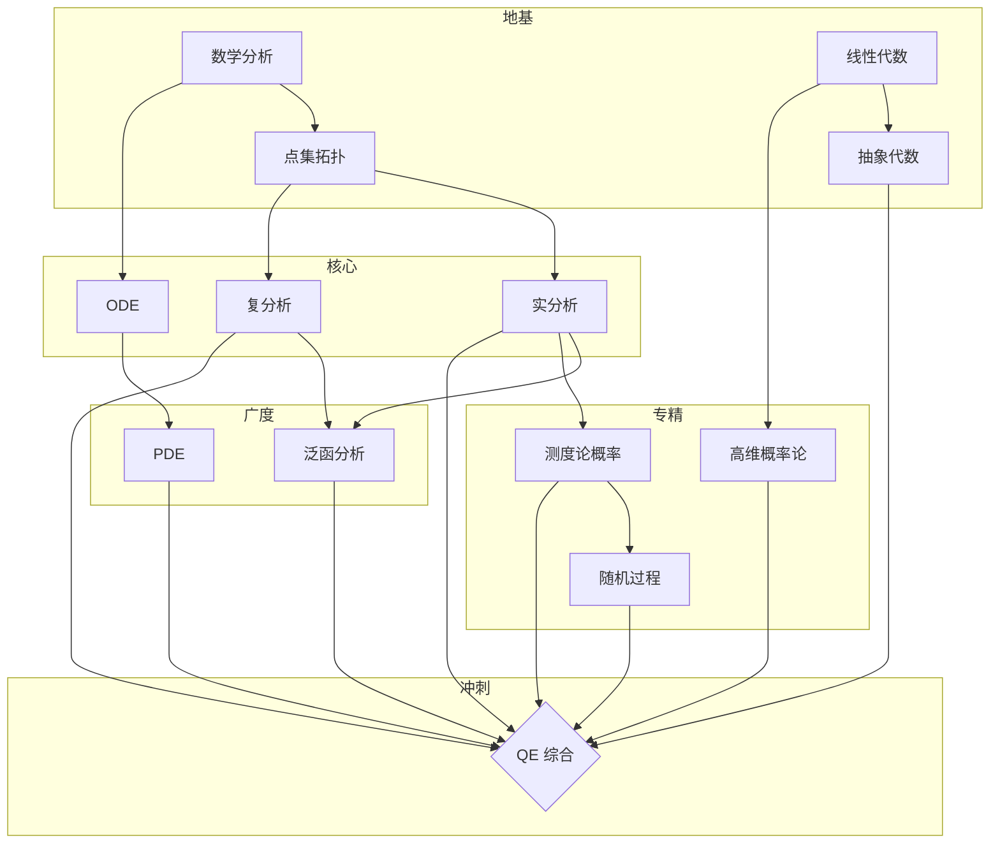

# 知识依赖关系

## 学习路径

1. **数学分析 + 线性代数** → **点集拓扑**（分析基础三件套）
2. **拓扑** → **实分析 + 复分析**（并行攻克 QE 重灾区）
3. **实分析** → **泛函分析**（谱理论核心链）
4. **数学分析** → **ODE → PDE**（方程方向）
5. **实分析** → **测度论概率 → 随机过程**（概率论专精线）
6. **线性代数** → **高维概率论**（算法理论线）
7. 全部 → **QE 冲刺**（Berkeley Problems + 概率论综合）
