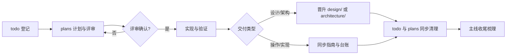

# 文档治理规范

状态：Current
确认状态：已确认
最后更新：2026-09-01
治理对象：文档分类与事实边界、确认状态、文档生命周期、代码与文档追溯、写作命名索引元数据、版本末期整理、归档与删除
依据：QED-Engine 根仓库 `docs/standards/doc-governance.md` 治理模式，适配单仓库规模（[ADR 0004](../adr/0004-standards-governance-alignment.md)）
关联测试：`tests/test_documentation.py`

## 目的与边界

本标准规定 QED-Tracker 每类文档保存什么事实、处于什么状态（暂定/已确认）、新建与晋升路径，
以及何时归档或删除。agent 与项目开发**优先读取已确认文档**；暂定文档可读可执行但地位低于
已确认文档。具体任务状态查 [待办列表](../trackers/todo.md)，长期决策查 [ADR 索引](../adr/index.md)。

**职责划分**：本文档治理文档共性链路（分类边界、确认状态、生命周期、命名、元数据、归档总纲）。
专项机制由专项标准承接：ADR 准入/编号/状态/取代→[ADR 治理规范](adr-governance.md)，
测试分层与门禁→[测试架构与门禁](testing.md)，跨项目需求传递→[跨项目协作规范](cross-project-collaboration.md)，
本地环境事实→[本地开发环境](local-dev.md)；本文档不复制其正文。

跨项目契约（服务端口 8901/8902、根 `.env` 变量、dataset 布局）以 QED-Engine 根仓库
`docs/design/` 与 `docs/architecture/` 为准，本仓库文档只链接不复制。

## 强制规则

### 文档分类与事实边界

| 位置 | 唯一职责 |
| --- | --- |
| 根 `README.md` | 面向用户的项目定位、安装、快速使用、数据位置与文档入口。 |
| 根 `AGENTS.md` | Agent 执行入口：项目目标、阅读顺序、任务路由、强制约束与门禁。只指引，不保存正文事实。 |
| 根 `CLAUDE.md` | Claude Code 加载入口：薄指针指向 `AGENTS.md`，不保存任何正文事实。 |
| `docs/index.md` 与各目录 `index.md` | 只导航当前文件，不保存正文事实。 |
| `docs/architecture/` | 当前系统边界、模块拓扑和数据不变量（含 code-map、API 文档、数据库文档）。 |
| `docs/design/` | 当前契约与接口：下载/清单、论文发现、服务与外部接口（含 Axiom 消费面）、主链路、来源与评审、数据设计、治理。**仅收已评审确定的设计**：未定稿/待评审设计一律随计划在 `docs/plans/` 承载，用户确定后以稳定名称迁入本目录（[ADR 0003](../adr/0003-pending-design-location.md)）。 |
| `docs/standards/` | 工程治理规则唯一事实源，入口 [规范索引](index.md)。 |
| `docs/adr/` | 影响长期约束的决定、理由、后果和取代关系。 |
| `docs/guides/` | 可重复执行的用户操作与开发门禁；为人类设计，由人类判断何时整理，agent 开发时不主动涉及。 |
| `docs/plans/` | 已批准且尚未关闭的实施计划；**待评审设计内容随计划承载**，确定后按 [ADR 0003](../adr/0003-pending-design-location.md) 迁入 `design/`。 |
| `docs/trackers/` | 全部未关闭任务、关闭台账、实时状态快照与无状态能力路线图。 |
| `docs/knowledge/` | 知识体系标准答案目录（QED-050）：领域与课程 JSON（含 target_path），作为探索产出的对照基准数据，不参与文档导航治理。 |
| `docs/history/` | 选择性保留的历史基线（旧系统、Math-QE）与归档 ADR。 |

一个事实只设一个维护位置，其他文档使用链接。标准不得复制操作命令、设计契约或 ADR 决策理由。

### 文档架构变更约束

未经 todo 任务 + plan 计划讨论确认，不得在 `docs/` 下新增文件夹改变文档架构。
新增文件夹必须：
1. 先在 `docs/trackers/todo.md` 创建任务
2. 在 `docs/plans/` 创建实施计划并评审
3. 更新本文档的「文档分类与事实边界」表格
4. 更新 `docs/index.md` 的文档域导航

### 确认状态

- 所有受治理文档（`architecture/`、`design/`、`standards/` 正文文档）声明
  `确认状态：暂定 | 已确认`；首批适用范围为 `standards/`，architecture/design 全量补登记
  列入 QED-039 版本末期轮待办。
- **已确认**：经评审通过的事实源，agent 与项目开发优先读取；**暂定**：可读可执行、待评审，
  地位低于已确认文档。
- 首批登记：`doc-governance.md`、`adr-governance.md`、`local-dev.md`、`testing.md`、
  `cross-project-collaboration.md` 均为**已确认**（2026-08-31 经用户确认）。
- **冲突优先级**：同一事实的多份文档冲突时，已确认 > 暂定；`architecture/` > `design/` >
  `plans/`；同类文档以最后更新时间较新者为准（不得以此绕过评审流程）。冲突无法自动判定时
  必须询问用户。
- **「可读可执行」的边界**：暂定文档允许 agent 基于其内容执行实现任务，但不得将暂定措辞
  提升为已确认标准；实现完成后暂定文档仍为暂定时，提交信息标注「基于暂定设计实现，待评审确认」；
  已确认与暂定文档冲突时，以已确认为准实现，并在 todo 登记待解决项。
- **转正评审触发条件**（满足任一）：
  1. 用户在对话中明确说「确认/通过/批准」该文档；
  2. 该文档关联的任务（todo）状态变为 Completed 且门禁通过；
  3. 该文档已通过 `tests/test_documentation.py` 相关守护且无 pending 评审标注。
  转正操作：`确认状态：暂定` 改 `已确认` 并刷新 `最后更新`。发现严重事实错误时，可由用户
  发起回退（改回暂定并标注原因）。

### 文档生命周期

- 新建文档链路：todo 登记 → 在 `plans/` 建计划 → 按计划实现（TDD）→ 验证与代码评审 →
  设计/契约以稳定名称（无日期前缀）迁入 `design/` 或合并进 `architecture/`，或操作结果同步
  `guides/` 与 `trackers/`。
- `design/` 文档只有 plans/ 下评审确认完毕才晋升；迁入时设计状态标 `Accepted`，确认状态
  初始为 `暂定`，随转正评审变为 `已确认`。
- 任务完成时**同时清理 todo 条目与对应 plans/ 文档**（见「归档与删除」的关闭计划两态判定）。
- 每次主线任务完成后梳理文档一致性：① `guides/` 由人类判断是否更新（agent 不主动整理）；
  ② 检查涉及模块的 `architecture/`、`design/` 文档是否需增改删；③ 检查 todo 证据列是否完整；
  ④ 完成任务从 todo 移入 `completed.md`；主线完成或长期任务重大变化在
  `project-status.md` 记录。

### 代码与文档追溯

`docs/architecture/code-map.md` 是代码/设计/测试映射的**唯一事实源**；设计文档头部与
code-map 的「设计关联」列只用于阅读时反查，不是第二份映射表。

- 所有受管且非豁免模块（豁免：`__init__.py`、`__main__.py`、无业务语义的极短文件）必须在
  code-map 恰好登记一次，声明层级职责、状态、设计关联与关联测试。
- 模块新增、移动或删除时，同一变更内同步 code-map 与关联设计文档；先用
  `rg "旧路径"` 全库扫描确认无残余引用。
- 修改代码前先在 code-map 定位模块职责与设计关联；契约变化先完成 ADR/设计，再同步实现、
  code-map 和语义测试。
- 本仓库不强制 `src/` 文件头 DesignRef（现状无此实践）；code-map 的「关联测试」列与
  `tests/test_documentation.py` 的代码引用守护共同保证双向可追溯。

### 写作、命名与索引

- 中文说明使用短句和明确主语；标识符、API 字段和外部协议名称保留英文。
- 文件名使用小写英文和连字符；活跃架构、设计、标准和指南使用稳定名称，不绑定产品版本。
- `plans/` 计划文件名格式：`YYYY-MM-DD-<类型>-<slug>.md`（全小写连字符，类型如 `req067`）。
- 文档目录入口统一为小写 `index.md`；`docs/**/README.md` 禁止存在。
- 内部链接显式指向文件或 `index.md`，不依赖托管平台目录解析。
- Mermaid 图与说明在同一正文维护，不提交派生图片。

### 元数据

- 架构和设计声明设计状态、实现状态、最后更新、关联代码、关联测试和关联 ADR。
- 标准声明状态、确认状态、最后更新、治理对象、依据、关联测试，并使用统一公共章节
  （目的与边界/强制规则/执行与门禁/变更与取代）。
- ADR 元数据与状态按 [ADR 治理规范](adr-governance.md) 执行。
- 指南、索引和 tracker 至少声明 `状态` 与 `最后更新`。
- 设计状态只允许 `Draft`、`Proposed`、`Accepted`、`Rejected`、`Superseded`、`Historical`；
  实现状态只允许 `Not Started`、`In Progress`、`Implemented`、`Verified`、`Blocked`、
  `Completed`；确认状态只允许 `暂定`、`已确认`。

`Implemented` 表示实现和本地定向门禁完成；`Verified` 还要求适用全量与远端门禁通过；`Blocked`
必须声明证据、恢复条件和责任位置。

**设计状态与确认状态正交**：设计状态描述设计方案本身的成熟度与命运，确认状态描述文档作为
事实源的权威性。禁止组合 `Historical + 暂定`（历史文档若保留应标已确认，否则不应保留）。
参考同类文档只能借用组织方式，必须重新确认状态、关联、范围和项目事实。

### 版本末期文档整理

本节固化每次版本确认前的文档整理轮，长期执行由 QED-039 承载
（机制源自 [ADR 0002](../adr/0002-version-cleanup-governance.md)，原独立标准
version-cleanup.md 并入本节）。

子项目版本纪元与根仓库一致：当前为 v0.1；`docs/adr/index.md` 声明当前版本。
版本切换由用户确认，agent 不自行判定。

**触发条件**：每次版本确认前（`develop` 合入 `main`、用户确认升版本时）执行一轮；
版本之间文档变化未达整理规模时，由 QED-039 todo 条目记录待整理项，版本末期统一处理。

**检查清单**：

1. **ADR 决策合并**：本版本新增 ADR 决策合并进 `architecture/` 或其他固定文档；
   `history/` 记录前版本；ADR 正文与编号保留（编号进入主分支后永不复用）。
2. **固定文档同步**：`plans/` 中已确定的内容必须同步到固定文档（`architecture/` 或 `design/`）——
   - API 路由/字段变更 → `architecture/api.md`；
   - 数据库表结构/迁移 → `architecture/database-schema.md`；
   - 写权限/状态机/跨项目契约 → `architecture/shared-tables.md`；
   - 探索管线/导入流程/下载流程等设计 → 对应 `design/` 文档或新建 plans 文档待后续晋升；
   - 版本末期确认更新后落 `architecture/`，更新前旧版本进 `history/`。
3. **design/ 三态梳理**：
   - 设计内容已并入固定文档的标 Superseded 并删除（内容由固定文档承接）；
   - 已完成使命的存档文档移入 `docs/history/`（如 `history/baselines/`）；
   - 仍具契约价值且任务未完成或后续轮继续使用的保持原状并更新实现状态。
4. **trackers/ 实时状态同步与清理**：
   - `todo.md`：已完成任务从活跃表移除并追加 `completed.md`（关闭结果 + 证据）；
   - 暂停/低优先级任务评估是否继续保留或归档；
   - 长期任务逐项审视：已完成的长期任务（如 QED-039）移入 `completed.md`，仍有效的保持并更新说明；
   - `project-status.md`（当前主线/服务状态刷新）、`roadmap.md` 无执行状态。
5. **确认状态补登记**：architecture/design/standards 文档确认状态字段补齐并核对
   （转正按「确认状态」节触发条件执行）。
6. **链接与引用完整**：`tests/test_documentation.py` 守护全部通过（入口集合/元数据/链接/
   代码引用/CLI 一致性/tracker ID）。
7. **metadata 规范化**：架构/设计文档的设计状态与实现状态取值合法、最后更新刷新、
   关联代码/关联测试准确。
8. **框架结构审视**：版本末期评估文档架构是否需要调整——
   - 若本版本新增/废弃了重要能力模块，评估 `architecture/`、`design/` 下文档是否需要拆分、合并或新建；
   - 若代码结构发生较大重构（如 `main.py` 拆分为多路由模块），同步更新 `code-map.md` 与 `system-overview.md`；
   - 结构变更需走「文档架构变更约束」流程（todo 登记 → plan 评审 → 实现）。
9. **项目流程重梳理**：版本末期为人类（非 agent）提供一次流程审视机会——
   - 刷新 `project-status.md` 当前主线与里程碑；
   - 刷新 `guides/development.md` 中的门禁命令（如有变更）；
   - 刷新 `guides/operations.md` 中的操作流程（如有变更）；
   - 评估是否需要更新 `AGENTS.md` 中的任务路由表（反映新增/移除的模块）；
   - 评估是否需要更新 `docs/index.md` 的文档域导航（反映新增/移除的文档目录）。

**执行流程**：读取 `code-map.md` 与 `project-status.md` 掌握当前状态 → 按检查清单逐项整理 →
每轮执行记录在 QED-039 todo 证据列登记 → 运行
`tests/test_documentation.py` 定向门禁，再运行完整门禁（见[开发指南](../guides/development.md)）→
评估框架结构是否需要调整（检查清单第 8 条）→ 为人类刷新项目流程文档（检查清单第 9 条）→
回执根仓库 REQ-002 / REQ-046（提交号 + 门禁输出）。

### 归档与删除

- Rejected/Superseded ADR 永久进入 `docs/history/adr/`。
- **关闭计划两态判定**（todo 任务结束时对 `docs/plans/` 文档的处理）：
  - **用户判定**：由用户在任务关闭时指定；未指定时 agent 按以下默认规则建议，经用户确认后执行；
  - **Retain（归档 `history/baselines/` 等历史目录）**：仅当记录已执行数据操作、迁移/发布
    里程碑、事故复盘或不可替代外部证据；
  - **Delete（删除）**：其余计划在事实已并入固定文档或同步于 tracker，且 Git 锚点有效后删除，
    不保留计划壳；
  - 两态均同步 todo 镜像并在 `plans/index.md` 登记去处。
- `design/` 三态梳理规则见「版本末期文档整理」检查清单第 3 条。
- 被整体替换的起源文档进入 `docs/history/baselines/`，标注范围、失效原因和不可变 Git commit
  摘要，不复制旧代码或文档树。
- 失效指南默认删除，旧操作从 commit 或 tag 恢复。
- 选择性保留的历史正文保持当时结论，只允许补充 Historical 声明、反向关系或修复链接。

## 执行与门禁

- `tests/test_documentation.py` 守护：文档入口集合、元数据、链接解析、代码/测试引用、
  Legacy 词禁令、CLI 命令与 parser 一致性、tracker ID 与活跃计划治理。
- 文档变更在提交前运行该测试与全量门禁（见[开发指南](../guides/development.md)）。
- 每次版本确认前按「版本末期文档整理」节执行文档整理轮。
- 涉及根仓库边界的文档变更，先确认根仓库规范与[跨项目协作规范](cross-project-collaboration.md)，
  不越权修改其内容。

## 变更与取代

改变文档分类、事实归属、确认状态、强制元数据、索引入口或归档条件时必须先新增 ADR。措辞、
勘误、链接和不改变语义的结构整理可直接修改。活跃标准不保留版本副本；旧内容从 Git 恢复或
按归档规则进入 `history/`。
