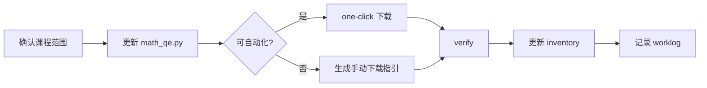

# QED-Tracker v0.2 任务清单

## 第一阶段：架构重构（已完成 ✅ 迁移至 resolved.md）

## 第二阶段：功能延续（后续）

| ID | 类型 | 描述 | 优先级 | 状态 |
|----|------|------|--------|------|
| T-201 | 执行 | 按课程有限目标补齐缺失教材（参见 v0.6 课程范围） | P1 | 🔄 各课程范围已定，按优先级执行 |
| T-202 | 执行 | 按领域检索 arXiv 论文 (math.CA/FA/AP/CV) | P2 | ⬜ |
| T-203 | 执行 | 官方文档镜像 wget --mirror (pytorch/sklearn/xgboost/yolo) | P2 | 🔄 |
| T-204 | 功能 | Resources Hub: resources 表对接、查询、收藏、导出 | P3 | 🔄 |
| T-205 | 功能 | GitHub 项目检索 (入 resources 表) | P3 | 🔄 |
| T-206 | 讨论 | ⚠️ 大模型方向 — 确定具体资料清单 | 待定 | ⬜ |
| T-207 | 新增 | 课程 11-13 概率论方向已纳入 math_qe.py (10 本缺失) | P1 | ✅ |

## T-201 进度

### 工具层就绪

| 子任务 | 状态 |
|--------|------|
| `TextbookTarget` 支持版本、类型、必需标记 | ✅ |
| `TextbookHunter.one_click_*` 严格补缺链路 | ✅ |
| `scripts/hunt_textbooks.py --one-click --missing-only --report` | ✅ |
| `scripts/probe_textbook_sources.py` 扩展来源探测 | ✅ |
| Open Library / Internet Archive / Google Books 探测 adapter | ✅ |

### 课程范围（v0.6 精简）

| 范围 | 课程 |
|------|------|
| 🟢 **已完结** | 01-数学分析, 04-实分析, 10-QE冲刺, 12-随机过程, 13-高维概率论 |
| 🟡 **有限目标** | 见下方清单 |

### 待补目标（按优先级）

| 优先级 | 课程 | 目标 | 方式 |
|--------|------|------|------|
| P0 | 03-点集拓扑 | 熊金城《点集拓扑学》 | 手动 |
| P0 | 06-泛函分析 | 张恭庆《泛函分析》 | 手动 |
| P0 | 07-常微分方程 | 丁同仁原书 + 阿诺德原书 | 手动 |
| P0 | 11-概率论 | 严士健《概率论基础》 | 手动 |
| P1 | 05-复分析 | Ahlfors 配套习题集 | 手动 |
| P1 | 08-PDE | 偏微分方程习题集 | 手动 |
| P1 | 09-抽象代数 | 冯克勤习题解答 | 手动 |
| P1 | 11-概率论 | 严士健习题集 | 手动 |
| P2 | 02-线性代数 | Axler LADR 4ed Solutions (GitHub) | `git clone` |

### 后续补充流程

**步骤说明**：
1. **勘定目标**：在 `math_qe.py` 中列出该课程最终需要的 targets（仅限当前范围）
2. **扫已有**：`--one-click --missing-only` 自动识别哪些已有
3. **自动化补缺**：对可自动化的来源（LibGen / GitHub）优先执行
4. **手动补缺**：对自动化失败的目标，`--report` 生成下载清单 → 手动下载放目录 → 重新 verify
5. **更新 inventory**：统计 + 状态表 + 优先级表
6. **更新 worklog**：记录本次补缺的内容和结果

## T-204 进度

| 子任务 | 状态 |
|--------|------|
| `app/tools/rss_tracker.py` — Quanta REST + Tao RSS 抓取 | ✅ |
| `app/collectors/frontier_collector.py` — 编排/去重/入库 | ✅ |
| `scripts/hunt_frontier.py` — CLI 入口 | ✅ |
| `app/repository/resource_repo.py` — URL 去重、搜索、收藏查询 | ✅ |
| `scripts/manage_resources.py` — list/search/favorite/export CLI | ✅ |
| `docs/design/resources_hub.md` — 资源中心设计 | ✅ |
| 种子数据首次入库 (`--seed`) | 🔄 代码就绪，需 MySQL 运行后执行 |
| LLM 摘要 (`--summary`) | ⬜ 预留

## T-205 进度

| 子任务 | 状态 |
|--------|------|
| `app/tools/github_downloader.py` — GitHub API 元数据工具 | ✅ |
| `app/collectors/github_collector.py` — GitHub repo 元数据入 resources | ✅ |
| `scripts/hunt_github.py` — repo 参数/文件输入 CLI | ✅ |
| LLM 清单批量接入 | ⬜ |

## 第三阶段：大模型方向（预留）

| ID | 类型 | 描述 | 优先级 |
|----|------|------|--------|
| T-301 | 内容 | 填写 `curricula/llm_research.py` — 定义 GitHub 仓库/arXiv 领域/文档目标 | 待定 |
| T-302 | 执行 | 大模型方向首次采集 | 待定 |

## 第四阶段：计算机 — LLM 冲刺 (v0.1)

| ID | 类型 | 描述 | 优先级 | 状态 |
|----|------|------|--------|------|
| T-401 | 内容 | `curricula/cs_llm_sprint.py` — 五阶段课程体系已定义 | P1 | ✅ |
| T-402 | 设计 | `docs/design/cs_llm_sprint.md` — CS/LLM 冲刺设计文档 | P1 | ✅ |
| T-403 | 采集 | Stage 1-3: DS/Algo/ML/DL 教材采集 (CLRS/ISLR/ESL/d2l.ai) | P1 | ⬜ |
| T-404 | 采集 | Stage 4: LLM 核心论文采集 (Attention/GPT/LLaMA via arXiv) | P1 | ⬜ |
| T-405 | 跟踪 | Stage 5: RAG/Agent 相关 GitHub 仓库跟踪 (langchain/llama_index) | P2 | ⬜ |
| T-406 | 采集 | Stage 4: NLP 教材采集 (Jurafsky & Martin SLP) | P2 | ⬜ |
| T-407 | 整理 | Stage 2-3/5: 视频资源整理入库 (CS229/CS231n/CS224N) | P3 | ⬜ |

## T-203 进度

| 步骤 | 状态 |
|------|------|
| `app/tools/wget_mirror.py` 新建 + wait 参数 | ✅ |
| `app/collectors/doc_scraper.py` 改为 wget 方案 + 每源独立 wait | ✅ |
| `app/tools/serve_docs.py` 本地 HTTP 文档查看服务 | ✅ |
| xgboost 镜像 (276 files, 11MB) | ✅ |
| sklearn 镜像 (203 files, 17.8MB) | ✅ |
| pytorch 镜像 (1549 files, 322MB) | ✅ |
| yolo 镜像 (1751 files, 534MB, partial) | ⚠️ 2h 超时 |

### 已知遗留问题

- **YOLO 镜像超时**：`docs.ultralytics.com` 使用 Next.js，wget 可能陷入无限递归。当前已下载 1751 文件足够浏览，如需完整镜像需改用 httpx+BS4 方案
- **CDN 外部资源**：PyTorch 的 Sphinx 主题引用了 Google Fonts 等 CDN 资源，wget 无法抓取，打开页面时需联网加载这些外部资源
- **PyTorch 版本号**：当前镜像指向 `docs/2.12/`，版本更新后需手动更新 URL
